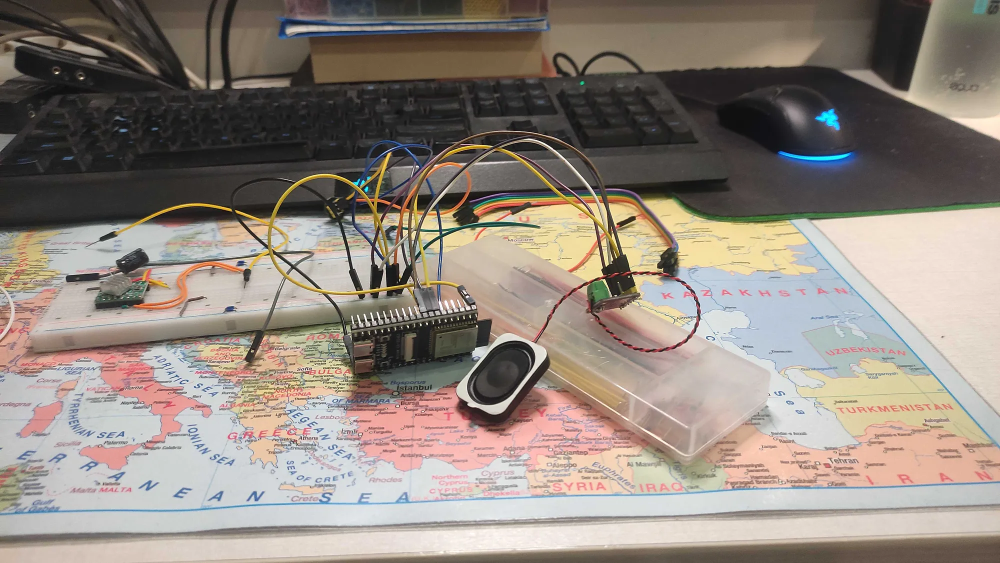
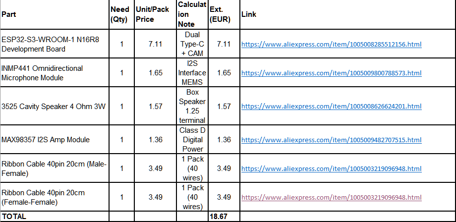

# Speaking ESP
# Description
What if we attach microphone and small speaker to esp board? And what about hooking this circuit with some LLMs. That's the whole idea of making esp chip talk. LLM is ran locally.

# Why
To understand more about communication between server and clients as well as to understand more how LLMs work and how I can run one myself. 

# Notes
- This idea is still in progress

# Gallery

# Wiring
Will add shortly.

# BOM

